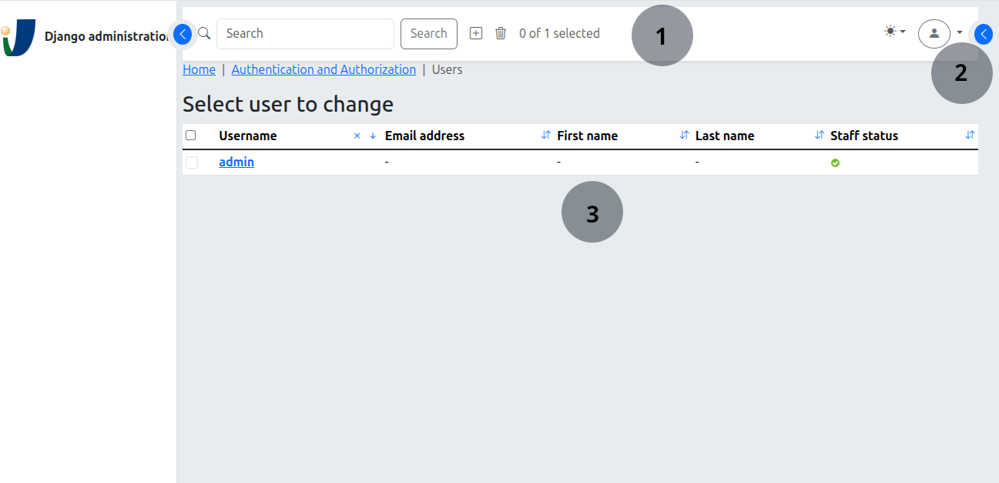

The admin changelist pages
==========================

:synopsis: Admin changelist pages appearance

Changelist pages has this basic structure:

where:

1. toolbar: displays the search box and admin actions on selected items,
2. filters: retractable side panel with list filter options, and
3. list items: items do be displayed.

Admin actions are presented as icon buttons instead of the classic selection
list. The icon used is inferred from the name of the admin action, as follows:

  1. if the change list object has an attribute with the same name as the 
     action and it has a 'djbs_icon' attribute, the icon name will be given 
     by these 'djbs_icon' attribute, or
  2. if the model_admin object has an attribute with the same name as the
     action and it has a 'djbs_icon' attribute, the icon name will be given
     by these 'djbs_icon' attribute, or
  3. the icon name will be the action_name

If the inferred icon name is not found in djbs `ICONS` setting
(see: :ref:`setting-variable-label`) then the *play* icon is used as default.