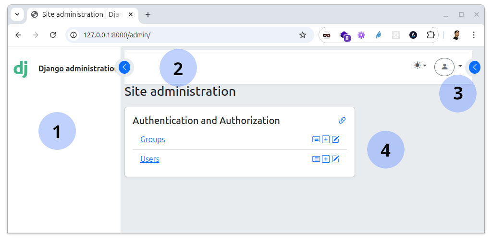

The admin index page
====================

:synopsis: Admin index page appearance

When installing and configuring `djbs-theme`, the appearance of the admin home 
page is presented with the theme structure, like this:

Where:

1: Collapsible menu
-------------------

The collapsible menu area displays the system menu 
(see :ref:`menu-system-label`)

2: Navigation bar
-----------------

The navigation bar displays the system navigation elements, such as the user 
menu, search box and other tools

3: Side navigation
------------------

Retractable side panel where information such as action history or changelist 
filters are displayed.

4: Dashboard
------------

Apps and models registered in the Admin are displayed. Each app is displayed 
as a card containing its models.