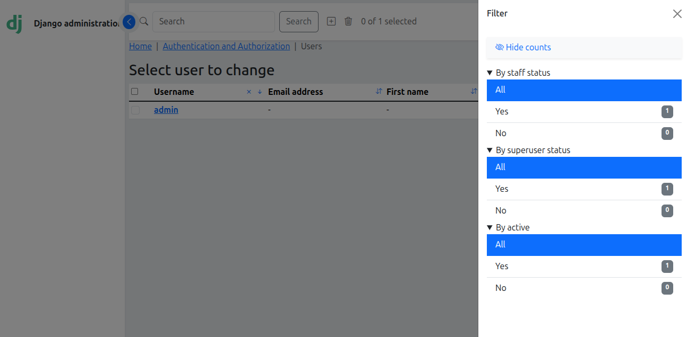

Model Admin options
===================

:synopsis: Extra options to Django ModelAdmin classes

`djbs_theme` adds some options to Django's `ModelAdmin` class so you can 
customize how it works. These options override the global djbs_theme settings 
for the ModelAdmin in question.

This is done by adding the following properties:

check_as_switch
---------------

defines whether checkboxes should be shown as switches. If true checkboxes are 
displayed as toggle switch buttons. See `Bootstrap documentation. 
<https://getbootstrap.com/docs/5.3/forms/checks-radios/#switches>`__

filter_style
------------

Defines the style of the changelist filters. The options are:

* ``djbs_constants.FILTER_STYLE_ACCORDION``:

  Filters are accordion panels and their options are checkboxes.

  .. image:: images/filter_acordion.png

* ``djbs_constants.FILTER_STYLE_CLASSIC``:

  Classic Django style with just bootstrap added.

  .. image:: images/filter_classic.png

* ``djbs_constants.FILTER_STYLE_DROPDOWN``:
  
  Each filter is a dropdown menu.

  .. image:: images/filter_dropdown.png

* ``djbs_constants.FILTER_STYLE_FORM``:
  
  Uses an HTML form where each filter is a select field. Filters are applied
  only when the submit button is clicked.

  .. image:: images/filter_form.png

fieldset_style
--------------

Defines the style of the changeform fieldsets. The options are:

* ``djbs_constants.STYLE_CARD``:
  
  each fieldset are displayed as a card

  .. image:: images/fieldset_card.png

* ``djbs_constants.STYLE_ACCORDION``:

  Uses bootstrap accordeon for fieldsets,
  
  .. image:: images/fieldset_acordion.png

* ``djbs_constants.STYLE_TAB``:

  Uses bootstrap tabs for fieldsets.

  .. image:: images/fieldset_tab.png

inlineset_style
---------------

Like fieldset_style, but defines the style of the changeform inlines.
The options are:

* ``djbs_constants.STYLE_CARD``: each fieldset are displayed as a card,
* ``djbs_constants.STYLE_ACCORDION``: Uses bootstrap accordeon for fieldsets,
* ``djbs_constants.STYLE_TAB``: Uses bootstrap tabs for fieldsets.

badgerize_facets
----------------

Defines whether the Django filter facets will be displayed as badges. See 
`Bootstrap documentation. <https://getbootstrap.com/docs/5.3/components/
badge/>`__

Bootstrap badges are not displayed when `filter_style` is 
`djbs_constants.FILTER_STYLE_FORM` because form filters uses html SELECT to
display filter options, and OPTION tag not accept inner html.

Model admin inlines
-------------------

admin.StackedInline.stacked_cols
^^^^^^^^^^^^^^^^^^^^^^^^^^^^^^^^

Also, in ``admin.StackedInline`` classes, the developer can define the number
of data columns to be displayed in each line adding the `stacked_cols` property
in class body.

admin.TabularInlie.hide_original
^^^^^^^^^^^^^^^^^^^^^^^^^^^^^^^^

``admin.TabularInlie.hide_original`` can set a `hide_original` boolean property
to define that the `original` column should be hidden.
